# Skill Server 技术方案 v1

---

## 1. 方案目标

本方案旨在构建一个可私有化部署、单体架构优先、支持中文/中英文检索、支持 Git 同步、版本管理、时间线、收藏、通知、下载、目录浏览与文件预览的 **Skills Hub** 平台。

### 1.1 核心目标

+ 私有 Skill 如何上传、创建、编辑、删除
+ Git 引入的 Skill 如何导入、同步、删除
+ 整个 Skill 目录如何做版本管理
+ 检索只读 `SKILL.md`，但时间线要展示整个目录的变更
+ 多人同时编辑同一个私有 Skill 如何处理
+ 单体架构下如何快速初始化、快速部署
+ 支持登录开启/关闭两种运行模式

### 1.2 非目标

+ 不做分布式微服务拆分
+ 不做多节点高可用
+ 不做复杂审批流
+ 不做全文检索范围扩展到整个目录全部文件
+ 不做外部消息推送系统强依赖

---

## 2. 核心设计理念

### 2.1 Skill 的管理单位

一个 Skill 的管理单位永远是 **整个目录**，不是单文件。

**示例结构：**

```text
skill-creator/
├── LICENSE.txt (11.1KB)
├── SKILL.md (32.4KB)
├── agents/
│   ├── analyzer.md (10.1KB)
│   ├── comparator.md (7.1KB)
│   └── grader.md (8.8KB)
├── assets/
│   └── eval_review.html (6.9KB)
├── eval-viewer/
│   ├── generate_review.py (16.5KB)
│   └── viewer.html (43.9KB)
├── references/
│   └── schemas.md (11.8KB)
└── scripts/
    ├── aggregate_benchmark.py (14.3KB)
    ├── generate_report.py (13.0KB)
    ├── improve_description.py (11.2KB)
    ├── package_skill.py (4.2KB)
    ├── quick_validate.py (4.2KB)
    ├── run_eval.py (11.6KB)
    ├── run_loop.py (14.2KB)
    └── utils.py (1.7KB)
```

系统中的上传、编辑、版本、时间线、下载、删除，全部围绕这个目录进行。

### 2.2 Skill 的检索单位

检索只读取 `SKILL.md` 内容。

**核心规则：**

+ **版本管理对象**：整个 Skill 目录
+ **检索对象**：仅 `SKILL.md`
+ **时间线对象**：整个目录的文件变更集合

### 2.3 Skill 来源类型

系统只管理两类 Skill：

| 能力 | private | git |
| --- | ---: | ---: |
| 上传 | 支持 | 不支持 |
| 页面创建 | 支持 | 不支持 |
| 页面编辑 | 支持 | 不支持 |
| 手动删除 | 支持 | 仅支持删除整个来源仓库 |
| 定时同步 | 不涉及 | 支持 |
| 版本时间线 | 支持 | 支持 |
| 检索 | 支持 | 支持 |

### 2.4 运行模式

系统支持三种运行模式，按安全性从高到低：

#### 模式一：登录开启模式（推荐生产环境）

**适用场景：** 企业生产环境、多人协作团队

**必须实现：**
+ 完整用户体系（JWT/OIDC）
+ 用户角色：admin / member
+ 资源角色：owner / maintainer / editor / viewer
+ 完整权限控制
+ 收藏功能
+ 消息通知
+ 审计到具体用户
+ 编辑锁归属到具体用户

#### 模式二：只读匿名模式（推荐对外展示）

**适用场景：** 对外展示、内部只读查询

**允许操作：**
+ 搜索
+ 详情查看
+ 时间线查看
+ 下载

**禁止操作：**
+ 上传
+ 创建
+ 编辑
+ 删除
+ Git 引入与同步
+ 收藏
+ 通知

**安全优势：**
+ 防止未授权修改
+ 适合公开演示
+ 降低安全风险

#### 模式三：初始化管理模式（仅限初始化阶段）

**适用场景：** 系统初始化、单用户试用、开发环境

**安全要求：**
+ 必须配置启动口令或内网白名单
+ 仅允许单管理员入口
+ 初始化完成后必须切换到登录开启模式
+ 禁止在生产环境长期使用

**允许操作：**
+ 所有操作（等同于登录开启模式的管理员）
+ 所有操作人统一记为 `bootstrap_admin`

**安全警告：**
+ 一旦暴露到办公网或跳板环境，任何人都能改数据、删仓库、触发同步
+ 审计信息失真
+ 必须在初始化完成后关闭此模式

#### 模式切换建议


**生产环境强制要求：**
+ 禁止使用"匿名可写"模式
+ 必须使用登录开启模式或只读匿名模式
+ 初始化管理模式仅用于系统初始化阶段

---

## 3. 架构设计

### 3.1 分层架构设计

参考 ClawHub 的分层职责设计，系统采用清晰的分层架构：

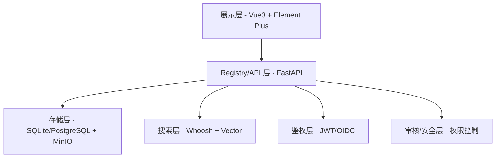

**分层职责：**

1. **展示层**：Vue3 + Vite + Element Plus，负责用户交互和页面渲染
2. **Registry/API 层**：FastAPI 单体应用，提供统一的 RESTful API
3. **存储层**：SQLite/PostgreSQL 存储元数据，MinIO/文件系统存储 Skill 包
4. **搜索层**：Whoosh-Reloaded + jieba 全文检索，Embedding + Vector 向量检索
5. **鉴权层**：支持 JWT/OIDC，可选开启/关闭
6. **审核/安全层**：权限控制、审计日志、安全检查

### 3.2 总体架构

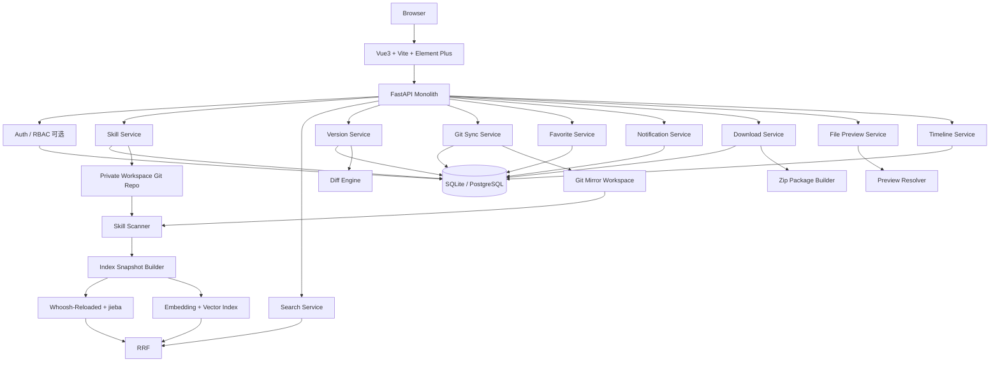

### 3.3 技术选型

#### 后端

+ **FastAPI**：单体应用，开发快，生命周期清晰
+ **SQLAlchemy 2.x / SQLModel**：ORM
+ **Pydantic**：数据验证
+ **APScheduler**：定时任务（凌晨清理、Git 同步）
+ **GitPython / Dulwich**：Git 操作
+ **Whoosh-Reloaded + jieba**：全文检索
+ **sentence-transformers**：向量嵌入
+ **本地向量索引**：精确余弦检索（可升级 FAISS）
+ **markdown-it-py**：Markdown 渲染
+ **Pygments**：语法高亮

#### 前端

+ **Vue 3** + **Vite** + **Element Plus**
+ **Monaco Editor**：文件编辑器

#### 数据库

+ **默认**：SQLite（快速部署）
+ **增强模式**：PostgreSQL（更高并发）

### 3.4 系统目录结构

后端严格遵守分层结构：API层 → Service层 → Repository层

```text
skills-hub/
├── app/
│   ├── api/                    # 路由层
│   │   ├── auth_routes.py
│   │   ├── search_routes.py
│   │   ├── skill_routes.py
│   │   ├── repo_routes.py
│   │   ├── timeline_routes.py
│   │   ├── favorite_routes.py
│   │   ├── notification_routes.py
│   │   ├── download_routes.py
│   │   └── admin_routes.py
│   │
│   ├── services/               # 业务逻辑层
│   │   ├── skill_service.py
│   │   ├── search_service.py
│   │   ├── version_service.py
│   │   ├── sync_service.py
│   │   ├── favorite_service.py
│   │   ├── notification_service.py
│   │   ├── download_service.py
│   │   ├── preview_service.py
│   │   └── timeline_service.py
│   │
│   ├── repositories/           # 数据访问层
│   ├── search/                 # 搜索模块
│   │   ├── tokenizer.py
│   │   ├── fulltext.py
│   │   ├── vector.py
│   │   ├── hybrid.py
│   │   └── index_manager.py
│   │
│   ├── git/                    # Git 操作模块
│   │   ├── private_repo.py
│   │   ├── mirror_repo.py
│   │   ├── scanner.py
│   │   └── diff_engine.py
│   │
│   ├── parsers/                # 文件解析模块
│   │   ├── skill_md_parser.py
│   │   ├── frontmatter_parser.py
│   │   └── file_type_resolver.py
│   │
│   ├── auth/
│   ├── core/
│   ├── db/
│   └── main.py
│
├── frontend/
├── config/
├── workspace/
│   ├── private-skills/         # 私有 Skill 工作区
│   └── mirrors/                # Git 镜像工作区
│
├── data/
│   ├── db/
│   ├── index/
│   ├── packages/
│   ├── cache/
│   └── logs/
│
└── deploy/
    ├── docker-compose.yml
    └── Dockerfile
```

### 3.5 核心原则

+ **分层规则**：API层 → Service层 → Repository层，严禁跨层级调用
+ **只有 Repository 层可以访问数据库**
+ **检索单位**：仅 `SKILL.md`
+ **版本管理单位**：整个 Skill 目录
+ **时间线展示单位**：整个目录的文件变更集合

---

## 4. 权限设计

### 4.1 角色体系

系统采用双层角色体系：系统角色 + 资源角色。

#### 4.1.1 系统角色

| 角色 | 说明 | 权限范围 |
| --- | --- | --- |
| `admin` | 系统管理员 | 全局管理、所有资源的管理权限、用户管理、系统配置 |
| `member` | 普通成员 | 基础操作权限、资源级权限由资源角色决定 |

#### 4.1.2 资源角色

| 角色 | 说明 | 权限范围 |
| --- | --- | --- |
| `owner` | 资源所有者 | 完全控制权限、删除权限、转让所有权、分配其他角色 |
| `maintainer` | 维护者 | 编辑权限、版本管理、同步管理、不能删除 |
| `editor` | 编辑者 | 编辑权限、不能删除、不能管理同步 |
| `viewer` | 查看者 | 只读权限、下载权限 |

### 4.2 权限矩阵

#### 4.2.1 私有 Skill 权限矩阵

| 操作 | admin | owner | maintainer | editor | viewer | member |
| --- |:---:|:---:|:---:|:---:|:---:|:---:|
| 查看 | ✅ | ✅ | ✅ | ✅ | ✅ | ✅ |
| 下载 | ✅ | ✅ | ✅ | ✅ | ✅ | ✅ |
| 编辑 | ✅ | ✅ | ✅ | ✅ | ❌ | ❌ |
| 删除 | ✅ | ✅ | ❌ | ❌ | ❌ | ❌ |
| 接管编辑锁 | ✅ | ✅ | ❌ | ❌ | ❌ | ❌ |
| 分配角色 | ✅ | ✅ | ❌ | ❌ | ❌ | ❌ |
| 转让所有权 | ✅ | ✅ | ❌ | ❌ | ❌ | ❌ |

#### 4.2.2 Git 仓库权限矩阵

| 操作 | admin | owner | maintainer | editor | viewer | member |
| --- |:---:|:---:|:---:|:---:|:---:|:---:|
| 查看 | ✅ | ✅ | ✅ | ✅ | ✅ | ✅ |
| 下载 | ✅ | ✅ | ✅ | ✅ | ✅ | ✅ |
| 导入 | ✅ | ❌ | ❌ | ❌ | ❌ | ❌ |
| 同步 | ✅ | ✅ | ✅ | ❌ | ❌ | ❌ |
| 删除 | ✅ | ✅ | ❌ | ❌ | ❌ | ❌ |
| 分配角色 | ✅ | ✅ | ❌ | ❌ | ❌ | ❌ |

#### 4.2.3 系统级权限矩阵

| 操作 | admin | member |
| --- |:---:|:---:|
| 用户管理 | ✅ | ❌ |
| 系统配置 | ✅ | ❌ |
| 日志查看 | ✅ | ❌ |
| 索引重建 | ✅ | ❌ |
| 全量同步 | ✅ | ❌ |
| 备份恢复 | ✅ | ❌ |

### 4.3 权限判断逻辑

#### 4.3.1 Skill 权限判断

```python
def check_skill_permission(user, skill, action):
    # 系统管理员拥有所有权限
    if user.role == 'admin':
        return True
    
    # 查看和下载权限：所有成员都有
    if action in ['view', 'download']:
        return True
    
    # 获取用户在该资源上的角色
    resource_role = get_resource_role(user.id, skill.id)
    
    # 根据操作类型判断权限
    if action == 'edit':
        return resource_role in ['owner', 'maintainer', 'editor']
    elif action == 'delete':
        return resource_role == 'owner'
    elif action == 'takeover_lock':
        return resource_role == 'owner'
    elif action == 'assign_role':
        return resource_role == 'owner'
    
    return False
```

#### 4.3.2 Git 仓库权限判断

```python
def check_repo_permission(user, repo, action):
    # 系统管理员拥有所有权限
    if user.role == 'admin':
        return True
    
    # 查看和下载权限：所有成员都有
    if action in ['view', 'download']:
        return True
    
    # 导入权限：仅管理员
    if action == 'import':
        return False
    
    # 获取用户在该资源上的角色
    resource_role = get_resource_role(user.id, repo.id)
    
    # 根据操作类型判断权限
    if action == 'sync':
        return resource_role in ['owner', 'maintainer']
    elif action == 'delete':
        return resource_role == 'owner'
    elif action == 'assign_role':
        return resource_role == 'owner'
    
    return False
```

### 4.4 资源角色分配

#### 4.4.1 私有 Skill 角色分配

**创建者自动成为 owner：**
+ 用户创建私有 Skill 后，自动获得 owner 角色
+ 可以分配其他用户为 maintainer/editor/viewer

**角色分配规则：**
+ owner 可以分配 maintainer/editor/viewer 角色
+ owner 可以转让所有权（需要二次确认）
+ admin 可以强制分配任何角色

#### 4.4.2 Git 仓库角色分配

**导入者自动成为 owner：**
+ 用户导入 Git 仓库后，自动获得 owner 角色
+ 可以分配其他用户为 maintainer/editor/viewer

**角色分配规则：**
+ owner 可以分配 maintainer/editor/viewer 角色
+ owner 可以转让所有权（需要二次确认）
+ admin 可以强制分配任何角色

### 4.5 权限审计

所有权限变更操作必须记录审计日志：

+ 角色分配/撤销
+ 所有权转让
+ 权限拒绝记录
+ 管理员强制操作

**审计日志字段：**
+ 操作人
+ 操作时间
+ 操作类型
+ 目标资源
+ 目标用户
+ 变更前后角色

### 4.1 Skill 包规范

```text
skill-name/
├── SKILL.md
├── LICENSE.txt
├── assets/
├── scripts/
├── references/
└── ...
```

**规则：**
+ `SKILL.md` 是唯一检索入口
+ 其他文件属于 Skill 包资产
+ 下载时整个目录作为一个包输出

### 4.2 `SKILL.md` 内容建议

推荐支持 Front Matter：

```markdown
---
name: Skill Creator
tags:
  - skills
  - creator
  - evaluation
summary: 用于创建、评估和迭代 skill 的完整工具集
---

# Skill Creator

## 用途
...

## 参数
...

## 使用方式
...

## 示例
...
```

### 4.3 抽取字段

从 `SKILL.md` 抽取：

+ `title`
+ `summary`
+ `tags`
+ `body_markdown`

**优先级：**

1. Front Matter
2. 第一个 H1
3. 首段摘要

---

## 5. 安全规范

### 5.1 上传安全规范

#### 5.1.1 文件上传限制

**文件大小限制：**
+ 单文件最大：50MB
+ 单次上传总大小：500MB
+ 单次上传文件数：1000个

**文件类型限制：**
+ 允许的文本文件：.md, .txt, .json, .yaml, .yml, .xml, .html, .css, .js, .ts, .py, .java, .go, .rs, .c, .cpp, .h, .sh, .sql, .conf, .ini, .env.example
+ 允许的图片文件：.png, .jpg, .jpeg, .gif, .svg, .ico
+ 允许的文档文件：.pdf, .doc, .docx
+ 禁止的可执行文件：.exe, .bat, .cmd, .sh, .ps1, .vbs, .jar, .war, .dll, .so, .dylib

#### 5.1.2 解压安全规范

**防 zip slip 攻击：**
```python
import os
import zipfile

def safe_extract(zip_path: str, target_dir: str):
    """安全解压 zip 文件"""
    with zipfile.ZipFile(zip_path, 'r') as zip_ref:
        for member in zip_ref.namelist():
            # 规范化路径
            member_path = os.path.normpath(member)
            
            # 检查路径穿越
            if member_path.startswith('..') or os.path.isabs(member_path):
                raise SecurityError(f"Path traversal detected: {member}")
            
            # 检查符号链接
            full_path = os.path.join(target_dir, member_path)
            if os.path.islink(full_path):
                raise SecurityError(f"Symbolic link detected: {member}")
            
            # 检查硬链接
            if os.path.exists(full_path) and os.stat(full_path).st_nlink > 1:
                raise SecurityError(f"Hard link detected: {member}")
        
        # 安全解压
        zip_ref.extractall(target_dir)
```

**禁止的文件系统对象：**
+ 符号链接（symlink）
+ 硬链接（hardlink）
+ 设备文件
+ 命名管道
+ Socket 文件

#### 5.1.3 内容安全检查

**敏感信息扫描：**
```python
import re

SENSITIVE_PATTERNS = [
    r'(?i)password\s*=\s*["\'][^"\']+["\']',
    r'(?i)api_key\s*=\s*["\'][^"\']+["\']',
    r'(?i)secret\s*=\s*["\'][^"\']+["\']',
    r'(?i)token\s*=\s*["\'][^"\']+["\']',
    r'-----BEGIN (RSA |EC |DSA )?PRIVATE KEY-----',
    r'(?i)aws_access_key_id\s*=\s*[A-Z0-9]{20}',
    r'(?i)aws_secret_access_key\s*=\s*[A-Za-z0-9/+=]{40}',
]

def scan_sensitive_content(content: str) -> list:
    """扫描敏感内容"""
    findings = []
    for pattern in SENSITIVE_PATTERNS:
        matches = re.finditer(pattern, content)
        for match in matches:
            findings.append({
                'pattern': pattern,
                'match': match.group(),
                'position': match.start()
            })
    return findings
```

### 5.2 Git 导入安全规范

#### 5.2.1 协议限制

**允许的协议：**
+ `https://`
+ `git://`
+ `ssh://`（仅限配置的 SSH 密钥）

**禁止的协议：**
+ `file://`
+ `ftp://`
+ `svn://`
+ 其他自定义协议

#### 5.2.2 域名白名单

**配置示例：**
```yaml
git:
  allowed_domains:
    - github.com
    - gitlab.company.internal
    - bitbucket.company.internal
  
  blocked_ips:
    - 127.0.0.0/8
    - 10.0.0.0/8
    - 172.16.0.0/12
    - 192.168.0.0/16
```

**防 SSRF 攻击：**
```python
import socket
import ipaddress

def validate_git_url(url: str):
    """验证 Git URL 防止 SSRF"""
    parsed = urlparse(url)
    
    # 检查协议
    if parsed.scheme not in ['https', 'git', 'ssh']:
        raise SecurityError(f"Protocol not allowed: {parsed.scheme}")
    
    # 检查域名白名单
    if parsed.hostname not in ALLOWED_DOMAINS:
        raise SecurityError(f"Domain not allowed: {parsed.hostname}")
    
    # 解析 IP 地址
    try:
        ip = socket.gethostbyname(parsed.hostname)
        ip_obj = ipaddress.ip_address(ip)
        
        # 检查是否为私有 IP
        if ip_obj.is_private:
            raise SecurityError(f"Private IP not allowed: {ip}")
    except socket.gaierror:
        raise SecurityError(f"Cannot resolve hostname: {parsed.hostname}")
```

#### 5.2.3 凭据管理

**凭据存储：**
+ 使用 secret 引用，绝不存储明文
+ 支持环境变量引用
+ 支持加密存储

**配置示例：**
```yaml
repos:
  - url: https://github.com/company/skills.git
    auth:
      type: ssh_key
      secret_ref: vault://secrets/git/ssh_key
  
  - url: https://gitlab.company.internal/skills.git
    auth:
      type: token
      secret_ref: env://GITLAB_TOKEN
```

### 5.3 预览安全规范

#### 5.3.1 HTML 预览沙箱

**默认行为：**
+ 默认显示源码，不直接渲染
+ 用户主动选择沙箱预览

**沙箱要求：**
```html
<iframe 
  sandbox="allow-scripts allow-same-origin"
  srcdoc="<html>...</html>"
  csp="default-src 'none'; script-src 'unsafe-inline'; style-src 'unsafe-inline'"
></iframe>
```

**CSP 策略：**
```
Content-Security-Policy: 
  default-src 'none';
  script-src 'unsafe-inline';
  style-src 'unsafe-inline';
  img-src data:;
  connect-src 'none';
  font-src 'none';
  object-src 'none';
  media-src 'none';
  frame-src 'none';
```

#### 5.3.2 文件预览限制

**文本文件预览：**
+ 最大预览行数：1000行
+ 最大预览大小：1MB
+ 超出时截断并提示

**图片文件预览：**
+ 最大图片尺寸：10MB
+ 支持格式：PNG, JPG, GIF, SVG
+ SVG 预览需禁用脚本

**二进制文件：**
+ 不在线预览
+ 仅显示文件信息
+ 提供下载链接

#### 5.3.3 MIME 类型白名单

```python
ALLOWED_MIME_TYPES = {
    'text/plain',
    'text/markdown',
    'text/html',
    'text/css',
    'text/javascript',
    'application/json',
    'application/xml',
    'image/png',
    'image/jpeg',
    'image/gif',
    'image/svg+xml',
    'application/pdf',
}

def validate_mime_type(file_path: str):
    """验证 MIME 类型"""
    import magic
    
    mime = magic.from_file(file_path, mime=True)
    if mime not in ALLOWED_MIME_TYPES:
        raise SecurityError(f"MIME type not allowed: {mime}")
```

### 5.4 日志脱敏规范

#### 5.4.1 敏感字段脱敏

**必须脱敏的字段：**
+ `password`
+ `token`
+ `secret`
+ `api_key`
+ `authorization`
+ `cookie`
+ `session_id`
+ `ssh_key`
+ `private_key`

**脱敏规则：**
```python
def mask_sensitive_data(data: dict) -> dict:
    """脱敏敏感数据"""
    SENSITIVE_FIELDS = [
        'password', 'token', 'secret', 'api_key', 
        'authorization', 'cookie', 'session_id'
    ]
    
    masked = {}
    for key, value in data.items():
        if any(field in key.lower() for field in SENSITIVE_FIELDS):
            masked[key] = '***MASKED***'
        elif isinstance(value, dict):
            masked[key] = mask_sensitive_data(value)
        else:
            masked[key] = value
    
    return masked
```

#### 5.4.2 日志记录白名单

**请求头白名单：**
```python
ALLOWED_HEADERS = [
    'content-type',
    'content-length',
    'user-agent',
    'x-trace-id',
    'x-span-id',
]
```

**请求体白名单：**
```python
ALLOWED_BODY_FIELDS = [
    'skill_name',
    'description',
    'tags',
    'source_type',
]
```

**禁止记录：**
+ 上传文件内容
+ Git 凭据
+ JWT Token
+ Cookie 完整值
+ Authorization 头

### 5.5 安全审计

#### 5.5.1 安全事件记录

**必须记录的安全事件：**
+ 上传文件被拒绝
+ Git 导入被拒绝
+ 敏感信息扫描发现
+ 权限验证失败
+ 异常访问模式

**审计日志字段：**
```json
{
  "event_type": "security",
  "event_name": "upload_rejected",
  "timestamp": "2026-03-19T10:30:00Z",
  "user_id": "user_001",
  "client_ip": "192.168.1.100",
  "details": {
    "reason": "file_type_not_allowed",
    "file_name": "malware.exe",
    "file_size": 1024
  }
}
```

#### 5.5.2 安全告警

**告警规则：**
+ 1小时内上传被拒绝超过10次
+ 1小时内权限验证失败超过20次
+ 发现敏感信息泄露
+ 检测到异常访问模式

---

## 6. 私有 Skill 管理设计

### 5.1 私有 Skill 的三种创建入口

私有 Skill 必须支持三种进入方式。

#### 5.1.1 入口一：整个 Skill 目录上传

**支持形式：**
+ 整个目录上传
+ 可兼容 zip 上传作为兜底方式

**处理规则：**

1. 校验目录中是否存在 `SKILL.md` 或 `skill.md`
2. 统一标准化为 `SKILL.md`
3. 解析 `SKILL.md` 的名称
4. 生成私有 Skill 目录
5. 将整个目录写入 `workspace/private-skills/`
6. 生成首个 revision
7. 建立目录树快照
8. 抽取 `SKILL.md` 内容进入检索索引

**名称规则优先级：**

1. Front Matter 中的 `name`
2. `SKILL.md` 第一个 H1
3. 上传目录名

#### 5.1.2 入口二：单个 `SKILL.md` 上传

**处理规则：**

1. 解析 skill 名称
2. 在 `workspace/private-skills/` 下创建对应目录
3. 将上传文件保存为 `SKILL.md`
4. 生成首个 revision
5. 建立检索索引

**示例：**

上传：
```text
SKILL.md
```

系统落盘后：
```text
workspace/private-skills/send-email/
└── SKILL.md
```

#### 5.1.3 入口三：页面直接创建

**页面能力：**
用户在页面点击"新建私有 Skill"后，系统打开创建页，默认提供 `SKILL.md` 模板。

**模板示例：**

```markdown
---
name: 新技能名称
tags:
  - 标签1
  - 标签2
summary: 一句话描述当前技能的用途
---

# 新技能名称

## 用途
请描述技能的使用场景

## 输入
请描述输入参数

## 输出
请描述输出结果

## 使用方式
请描述使用步骤

## 示例
请给出一个简单例子
```

**提交流程：**

1. 用户填写模板
2. 点击提交
3. 二次确认
4. 系统创建目录
5. 保存 `SKILL.md`
6. 生成首个 revision
7. 建立检索索引

### 5.2 私有 Skill 的页面编辑

只有 `private` 类型 Skill 支持页面编辑。

#### 5.2.1 编辑页结构

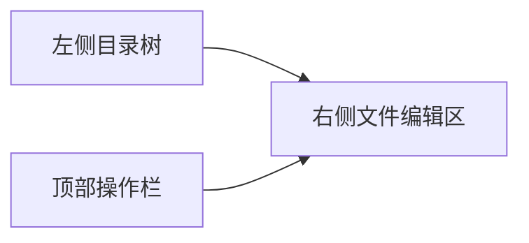

**页面组成：**

**左侧：**
+ 当前 Skill 的完整目录树
+ 支持新建文件
+ 支持新建文件夹
+ 支持删除文件
+ 支持重命名

**右侧：**
+ 当前选中文件编辑器
+ 不同文件类型采用不同编辑模式
+ `SKILL.md` 使用 Markdown 编辑模式
+ 代码/配置文件使用代码编辑模式

**顶部：**
+ 保存提交
+ 放弃修改
+ 当前锁状态
+ 当前基线 revision

#### 5.2.2 编辑规则

**支持能力：**
+ 创建文件
+ 创建目录
+ 修改文件
+ 删除文件
+ 重命名文件

**不支持能力：**
+ 不支持草稿
+ 不支持分步局部提交
+ 不支持 Git Skill 编辑

**生效规则：**
所有修改必须在一次提交中整体生效。

#### 5.2.3 编辑提交流程

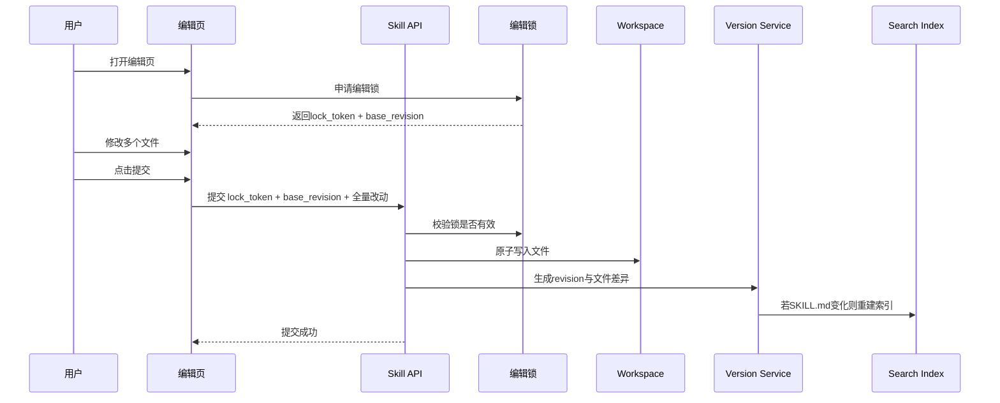

### 5.3 多人编辑同一个私有 Skill 的解决方案

这个问题必须显式设计，否则页面编辑一定会冲突。

#### 5.3.1 设计原则

采用：**软锁 + 基线版本校验 + 提交时冲突拒绝**

不做复杂协同编辑，不做实时合并。

#### 5.3.2 编辑锁模型

当用户进入私有 Skill 编辑页时：

+ 系统创建一条编辑会话 `edit_session`
+ 返回：
    - `lock_token`
    - `base_revision`
    - `lock_expire_at`

**锁规则：**
+ 同一时刻只允许一个有效编辑锁
+ 锁有 TTL，例如 15 分钟
+ 前端编辑页定时心跳续租
+ 用户退出页面或提交后主动释放锁
+ 超时未续租则锁自动失效

#### 5.3.3 其他用户进入时的处理

**情况 A：已有有效锁**

系统提示：
+ 当前正在被某人编辑
+ 显示锁持有人
+ 显示锁剩余时间
+ 当前用户只能只读查看，不能进入编辑态
+ 管理员可强制接管

**情况 B：无有效锁**

允许进入编辑页并获取锁

#### 5.3.4 提交冲突校验

即使拿到了锁，提交时仍要校验 `base_revision`。

**提交失败条件：**
出现以下任一情况则拒绝提交：

+ 当前锁已失效
+ 当前锁不属于提交人
+ 当前 Skill 最新 revision 已经不是 `base_revision`

**失败反馈：**
页面提示：
+ 当前内容已被他人更新
+ 请刷新后重新进入编辑

这样可以避免"旧页面覆盖新版本"。

---

## 6. Git Skill 管理设计

Git Skill 不允许在页面直接编辑、创建、上传单文件。

Git Skill 的来源只能是：**导入一个外部 Git 仓库，并从其中识别包含 `SKILL.md` 的目录。**

### 6.1 Git 仓库导入

**导入步骤：**

1. 用户输入仓库地址
2. 选择分支
3. 系统做重复检查
4. clone 到 mirror 工作区
5. 扫描 `**/SKILL.md` / `**/skill.md`
6. 建立 Skill 列表
7. 生成首个同步 revision
8. 建立检索索引

### 6.2 重复仓库检查

导入时必须检查是否重复。

**重复判断：**
使用仓库指纹：

```text
repo_fingerprint = normalize(repo_url) + branch
```

**规范化内容：**
+ 去掉协议差异影响
+ 去掉 `.git` 后缀差异
+ 统一 host 大小写
+ 统一 ssh / https 的同仓库映射

**重复结果：**
若已存在相同仓库源：

+ 禁止重复导入
+ 页面提示已存在
+ 引导用户直接去仓库详情页管理

### 6.3 Git Skill 的同步

+ 支持手动同步
+ 支持定时同步

**同步后：**
+ 扫描 Skill 目录变化
+ 生成 revision
+ 若 `SKILL.md` 变化则更新索引
+ 若仅其他文件变化则只更新时间线与 `updated_at`

### 6.4 Git 同步流程

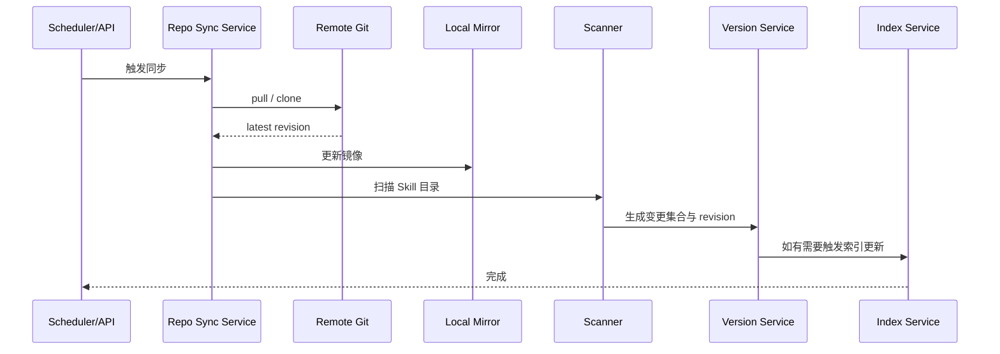

---

## 7. 删除设计

删除逻辑要求很明确，必须分开处理。

### 7.1 删除通用规则

所有删除操作都必须二次确认。

**确认弹窗中至少显示：**

+ Skill 名称 / 仓库名称
+ 来源类型
+ 删除影响范围
+ 删除后是否立即不可见
+ 是否为不可恢复操作

### 7.2 Git Skill 删除

**原则：**
非私有 Skill 不能按单个 Skill 删除。

因为它的来源是一个 Git 仓库，所以：**只能删除整个引入的 Git 仓库**

**删除入口：**
虽然删除按钮放在 Skill 详情页内，但对于 Git Skill：

+ 按钮文案应显示为：`删除来源仓库`
+ 点击后跳到仓库级删除确认

**权限：**
+ 所有成员都可以删除 Git 仓库来源

**删除结果：**
+ 该仓库下的所有 Skill 立即从页面和检索中消失
+ 仓库镜像删除
+ 数据状态改为已删除
+ 后续允许再次导入同一仓库

**Git 仓库删除流程：**

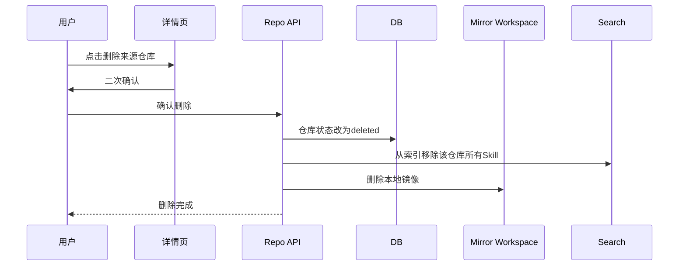

### 7.3 私有 Skill 删除

**原则：**
私有 Skill 可以按单个 Skill 删除。

**权限：**
+ 所有成员都可以删除私有 Skill

**删除行为：**
删除后不是立刻物理删除，而是两阶段处理：

#### 第一阶段：立即隐藏

+ 当前 Skill 从搜索结果中排除
+ 页面列表中不可见
+ 状态标记为 `deleted_pending_purge`
+ 记录删除操作审计

#### 第二阶段：凌晨统一物理删除

+ 后台凌晨定时任务执行统一清理
+ 真正删除 Skill 目录文件
+ 写入最终删除 revision / 清理日志

**好处：**
+ 用户界面立即生效
+ 后台文件清理统一处理
+ 不影响当前在线请求
+ 便于做批量夜间维护

**私有 Skill 删除流程：**

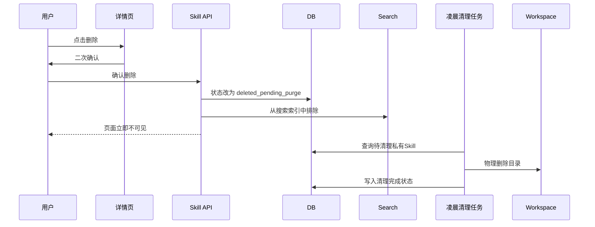

---

## 8. 版本管理与时间线设计

### 8.1 版本管理对象

整个 Skill 目录都进入版本管理。

### 8.2 检索对象

只有 `SKILL.md` 进入检索。

### 8.3 三类变更场景

#### 场景 1：其他文件变，`SKILL.md` 不变

+ 生成 revision
+ 更新时间线
+ 更新 `updated_at`
+ 不更新检索内容
+ 不重建索引

#### 场景 2：只有 `SKILL.md` 变

+ 生成 revision
+ 更新时间线
+ 更新 `updated_at`
+ 更新 `search_updated_at`
+ 重建索引

#### 场景 3：`SKILL.md` 与其他文件都变

+ 生成 revision
+ 更新时间线
+ 更新 `updated_at`
+ 更新 `search_updated_at`
+ 重建索引

### 8.4 时间线展示要求

时间线要接近 GitHub 变更页风格。

**每个 revision 展示：**

+ revision 编号
+ 操作人
+ 时间
+ 变更类型标签
+ 新增/修改/删除文件数
+ 是否影响搜索
+ 文件清单
+ 文件 diff/预览

### 8.5 时间字段定义

| 字段 | 含义 |
| --- | --- |
| `updated_at` | 整个 Skill 最后更新时间 |
| `search_updated_at` | `SKILL.md` 最后更新时间 |
| `indexed_at` | 当前索引最后构建时间 |

---

## 9. 搜索设计

### 9.1 搜索架构设计

参考 ClawHub 的搜索思路，采用**召回层 + 精排层 + 业务加权**的三层架构：

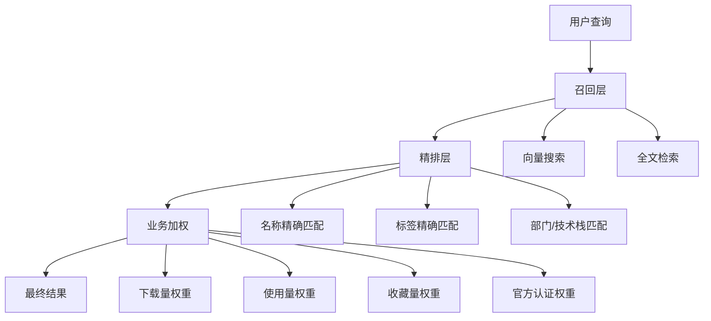

### 9.2 检索范围

+ 仅索引 `SKILL.md`
+ 其他文件不进入全文索引与向量索引

### 9.3 索引字段

+ `title`（权重 ×3）
+ `summary`（权重 ×2）
+ `tags`（权重 ×2）
+ `body_markdown`（权重 ×1）

### 9.4 搜索模式

+ `fulltext`：全文检索（Whoosh-Reloaded + jieba）
+ `vector`：向量检索（Embedding + 精确余弦）
+ `hybrid`：混合检索（RRF 融合）

### 9.5 过滤维度

+ `source_type`：来源类型（private / git）
+ `repo_source_id`：仓库源 ID
+ `status`：状态

### 9.6 排序方式

+ `relevance`：相关度
+ `favorite_count`：收藏数
+ `download_count`：下载数
+ `updated_at`：更新时间
+ `blend`：混合排序

**blend 公式：**

```text
final_score =
  0.55 × relevance_score
+ 0.20 × favorite_score
+ 0.15 × download_score
+ 0.10 × freshness_score
```

### 9.7 技术实现

+ **全文索引**：Whoosh-Reloaded + jieba 分词
+ **向量索引**：sentence-transformers + 本地向量索引
+ **可升级**：向量替换为 FAISS，增加 rerank

---

## 10. 标签体系设计

### 10.1 标签体系架构

参考 ClawHub 的标签体系设计，建立多维度标签系统：

**标签维度：**

1. **功能标签**：描述 Skill 的功能类型
   - 示例：`code-review`、`document-generation`、`data-analysis`

2. **技术栈标签**：描述 Skill 使用的技术栈
   - 示例：`python`、`javascript`、`fastapi`、`react`

3. **部门标签**：描述 Skill 所属部门
   - 示例：`ai-platform`、`backend-team`、`frontend-team`

4. **语言标签**：描述 Skill 支持的语言
   - 示例：`zh-CN`、`en-US`、`multi-language`

5. **状态标签**：描述 Skill 的状态
   - 示例：`official`、`community`、`experimental`

### 10.2 标签管理

**标签来源：**

1. **自动提取**：从 `SKILL.md` 的 Front Matter 中提取
2. **手动添加**：用户在创建/编辑时手动添加
3. **系统生成**：基于内容分析自动生成

**标签权重：**

+ 官方认证标签：权重 ×2
+ 用户手动标签：权重 ×1.5
- 自动提取标签：权重 ×1

### 10.3 标签搜索

**标签搜索逻辑：**

1. 精确匹配标签名称
2. 支持标签层级（如 `code-review/python`）
3. 支持标签别名（如 `py` → `python`）
4. 支持标签组合搜索（如 `python AND web`）

---

## 11. 来源追踪与版本锁定机制

### 11.1 核心概念澄清

参考 ClawHub 的 lock/origin/fingerprint 机制，建立完整的来源追踪与版本锁定体系。

**重要概念区分：**

1. **编辑锁** (`edit_session.lock_token`)：解决多人同时编辑冲突（已在第5章设计）
2. **依赖锁** (`skills.lock.json`)：项目依赖版本锁定（客户端/项目侧）
3. **origin**：来源追踪（服务端元数据）
4. **fingerprint**：内容指纹（服务端 revision 层）

### 11.2 整体架构

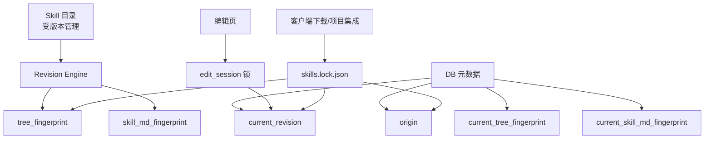

### 11.3 Origin 机制（来源追踪）

**作用：** 记录 Skill 的来源信息，便于追溯和更新。

**回答的问题：**
+ 它是 `private` 还是 `git`
+ 如果是 `git`，来自哪个仓库、哪个分支、哪个目录
+ 如果是 `private`，是目录上传、单文件上传，还是页面创建
+ 后续更新、审计、删除、追责时该回到哪里去找

**私有 Skill 示例：**

```json
{
  "origin_type": "private",
  "origin_locator": "private://skill/sk_01JXYZ",
  "origin_ref_id": "sk_01JXYZ",
  "origin_mode": "upload_folder",
  "upstream_repo_id": null,
  "upstream_repo_fingerprint": null,
  "upstream_branch": null,
  "upstream_commit": null,
  "upstream_skill_path": null,
  "created_from_revision": 1
}
```

**Git Skill 示例：**

```json
{
  "origin_type": "git",
  "origin_locator": "git+https://github.com/acme/skills.git#main:/python/code-review",
  "origin_ref_id": "repo_01JABC",
  "origin_mode": "git_import",
  "upstream_repo_id": "repo_01JABC",
  "upstream_repo_fingerprint": "github.com/acme/skills|main",
  "upstream_branch": "main",
  "upstream_commit": "4d8a9d2",
  "upstream_skill_path": "python/code-review",
  "created_from_revision": 1
}
```

**解决的问题：**
+ 这个 skill 是从哪个 registry 下载的
+ 是官方 skill、团队 skill，还是个人私有 skill
+ 是从 Git 仓库导入的，还是页面手工创建的
+ 以后更新、回源、审计时去找谁

### 11.4 Fingerprint 机制（内容指纹）

**作用：** 记录 Skill 内容的唯一指纹，用于检测内容变化。

**双层指纹设计：**

#### A. `tree_fingerprint`

对整个 Skill 目录做指纹，用于版本、时间线、下载、更新判断。

**指纹算法：**

目录指纹不要直接对 zip 包做 hash，应该对"规范化清单"做 hash：

1. 扫描 Skill 根目录下所有受管文件
2. 排除临时文件，比如 `.DS_Store`、编辑器缓存、平台元数据目录
3. 按相对路径排序
4. 每个文件计算 `sha256(file_bytes)`
5. 生成 manifest
6. 对 manifest JSON 再做 `sha256`

**示例 manifest：**

```json
{
  "algo": "sha256-tree-v1",
  "files": [
    {"path": "SKILL.md", "sha256": "aaa", "size": 1024},
    {"path": "agents/analyzer.md", "sha256": "bbb", "size": 2048},
    {"path": "scripts/run.py", "sha256": "ccc", "size": 4096}
  ]
}
```

#### B. `skill_md_fingerprint`

只对 `SKILL.md` 做指纹，用于检索是否需要重建。

**最终指纹结构：**

```json
{
  "tree_fingerprint": "sha256:9d0f7c...",
  "skill_md_fingerprint": "sha256:12ab45..."
}
```

**解决的问题：**
+ 本地 skill 有没有被改过
+ 本地内容和平台上的版本是否完全一致
+ 两个看起来同名的 skill 是否其实内容不同
+ 发布时是不是重复内容

### 11.5 Lock 机制（项目依赖锁定）

**作用：** 某个项目/某个工作区到底固定使用了哪些 Skill 版本。

**重要说明：** 这个 `lock` 不是编辑锁，而是项目依赖锁定文件。它对平台后台不是强依赖，但对后续 CLI、IDE、本地工作区集成会非常重要。

**推荐 lock 文件结构：**

```json
{
  "schema_version": 1,
  "generated_at": "2026-03-19T18:30:00Z",
  "registry": "https://skills.company.internal",
  "skills": {
    "code-review": {
      "skill_uid": "sk_01JXYZ",
      "revision": 12,
      "tree_fingerprint": "sha256:9d0f7c...",
      "skill_md_fingerprint": "sha256:12ab45...",
      "origin_locator": "private://skill/sk_01JXYZ",
      "source_type": "private",
      "install_path": "skills/code-review"
    },
    "prd-writer": {
      "skill_uid": "sk_01JAAA",
      "revision": 5,
      "tree_fingerprint": "sha256:88aa11...",
      "skill_md_fingerprint": "sha256:67cc22...",
      "origin_locator": "git+https://github.com/acme/skills.git#main:/prd/prd-writer",
      "source_type": "git",
      "install_path": "skills/prd-writer"
    }
  }
}
```

**解决的问题：**
+ 同一个项目里，大家用的 skill 版本要一致
+ 线上、测试、开发环境要一致
+ 以后回滚时，知道当时到底用了哪个版本

### 11.6 元数据存储原则

**重要设计原则：**

**不要把 `.origin.json`、`.fingerprint.json` 这种元数据放进 Skill 管理目录**

因为 Skill 目录本身就是管理、版本、时间线、下载对象。如果把元数据放进 Skill 目录，那它们自己也会被纳入 revision 和 fingerprint 计算，形成"元数据改动导致目录指纹变化，目录指纹变化又反过来更新元数据"的循环。

**正确做法：**

服务端内部用下面两层：

```text
/app/workspace/private-skills/<slug>/        # 纯业务内容目录
/app/workspace/mirrors/<repo_id>/            # 纯镜像目录
/app/workspace/_meta/skills/<skill_uid>/     # 平台元数据缓存（可选）
```

**推荐：** 把这些信息直接落 DB，只把 manifest 大对象按需落磁盘缓存。

**客户端/项目侧：**

在下载到用户项目、或者 CLI 安装到本地工作区时，才适合生成：

```text
project/
  skills/
    code-review/
    prd-writer/
  skills.lock.json
```

### 11.7 数据库设计

所有字段已整合到第18章的表结构定义中，包含完整的字段定义、唯一约束和索引设计。

### 11.8 更新流程

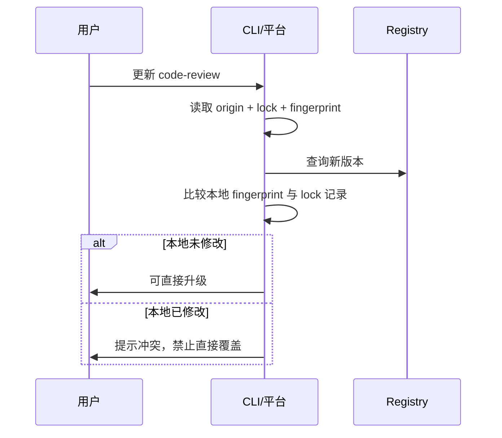

---

## 12. 收藏、通知、下载设计

### 12.1 收藏

+ 用户可收藏 Skill
+ 可查看"我的收藏"
+ 可取消收藏
+ 收藏数量参与排序
+ **无登录模式**：关闭

### 12.2 通知

**触发条件：** 收藏的 Skill 发生任意 revision 变更时触发通知

**通知内容：**
+ Skill 名称
+ 版本号
+ 变更时间
+ 变更类型
+ 是否影响搜索
+ 快速跳转到时间线详情

**无登录模式**：关闭

### 12.3 下载

**规则：**
+ 下载整个 Skill 目录
+ 压缩包文件名：`{skill-name}-{timestamp}.zip`
+ 压缩包内第一层目录：Skill 名称目录
+ 保留完整目录结构

**示例：**

```text
skill-creator-20260319T143025Z.zip
└── skill-creator/
    ├── SKILL.md
    ├── agents/
    └── ...
```

**统计：**
+ 后端实际响应下载时记录
+ 记录谁下载了
+ 页面展示下载次数

**无登录模式**：记录为 `anonymous` 或 session/cookie

---

## 13. 日志管理设计

### 13.1 日志体系架构

系统需要建立完整的日志体系，包括链路日志、操作日志、系统日志三类。

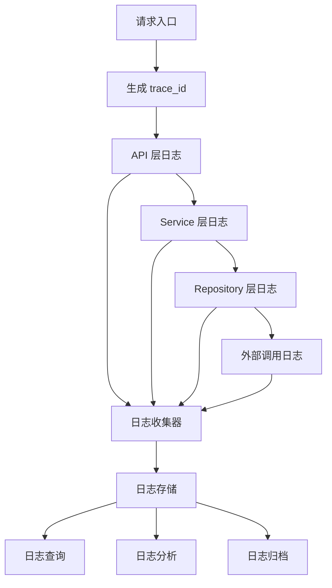

### 13.2 链路日志设计

#### 13.2.1 链路追踪机制

**目标：** 实现请求的完整链路追踪，便于问题排查和性能分析。

**核心概念：**

+ `trace_id`：全局唯一请求标识，贯穿整个请求链路
+ `span_id`：单个操作标识，标识链路中的某个节点
+ `parent_span_id`：父操作标识，构建调用树
+ `baggage`：上下文传递的元数据

**生成规则：**

```python
import uuid
import time

def generate_trace_id():
    """生成全局唯一 trace_id"""
    return f"trace_{int(time.time() * 1000)}_{uuid.uuid4().hex[:8]}"

def generate_span_id():
    """生成 span_id"""
    return f"span_{uuid.uuid4().hex[:12]}"
```

**传递方式：**

1. **HTTP 请求**：通过 `X-Trace-Id` 和 `X-Span-Id` Header 传递
2. **异步任务**：通过任务参数传递
3. **定时任务**：在任务启动时生成新的 trace_id

#### 13.2.2 链路日志记录点

**API 层：**

+ 请求入口：记录请求方法、路径、参数、客户端信息
+ 请求出口：记录响应状态、响应时间、响应大小
+ 异常捕获：记录异常信息、堆栈信息

**Service 层：**

+ 业务操作开始：记录操作类型、输入参数
+ 业务操作结束：记录操作结果、耗时
+ 外部调用：记录调用目标、参数、结果、耗时

**Repository 层：**

+ 数据库查询：记录 SQL、参数、耗时
+ 缓存操作：记录缓存键、操作类型、命中情况
- 文件操作：记录文件路径、操作类型、耗时

#### 13.2.3 链路日志结构

```json
{
  "trace_id": "trace_1708123456789_abc12345",
  "span_id": "span_123456789abc",
  "parent_span_id": "span_987654321def",
  "timestamp": "2026-03-19T10:30:00.123Z",
  "level": "INFO",
  "logger": "skill_service",
  "message": "创建 Skill 成功",
  "context": {
    "user_id": "user_001",
    "skill_uid": "sk_01JXYZ",
    "operation": "create_skill",
    "source_type": "private"
  },
  "duration_ms": 125,
  "http": {
    "method": "POST",
    "path": "/api/v1/skills/private/upload-folder",
    "status_code": 200,
    "client_ip": "192.168.1.100"
  },
  "extra": {
    "file_count": 5,
    "total_size": 10240
  }
}
```

### 13.3 操作日志设计

#### 13.3.1 操作日志类型

**审计日志** (`audit_logs`)：

+ 用户操作：登录、登出、权限变更
+ Skill 操作：创建、编辑、删除、下载
+ 仓库操作：导入、同步、删除
+ 系统操作：配置变更、定时任务执行

**业务日志** (`business_logs`)：

+ 搜索日志：搜索关键词、过滤条件、结果数量
+ 访问日志：页面访问、API 调用
+ 性能日志：慢查询、慢接口、异常耗时

**系统日志** (`system_logs`)：

+ 启动日志：应用启动、配置加载
+ 错误日志：异常、错误、警告
+ 性能日志：内存、CPU、磁盘使用情况

#### 13.3.2 操作日志记录策略

**同步记录：**

+ 关键操作：创建、编辑、删除、权限变更
+ 安全相关：登录、登出、权限验证
+ 审计必需：需要实时审计的操作

**异步记录：**

+ 访问日志：页面访问、API 调用
+ 性能日志：慢查询、慢接口
+ 统计日志：搜索、下载统计

#### 13.3.3 操作日志结构

**审计日志示例：**

```json
{
  "id": "audit_001",
  "timestamp": "2026-03-19T10:30:00.123Z",
  "trace_id": "trace_1708123456789_abc12345",
  "actor_id": "user_001",
  "actor_name": "alice",
  "actor_ip": "192.168.1.100",
  "action": "create_skill",
  "action_type": "write",
  "target_type": "skill",
  "target_id": "sk_01JXYZ",
  "target_name": "code-review",
  "detail": {
    "source_type": "private",
    "origin_mode": "upload_folder",
    "file_count": 5,
    "total_size": 10240
  },
  "result": "success",
  "duration_ms": 125
}
```

### 13.4 日志存储设计

#### 13.4.1 存储策略

**热数据（最近7天）：**

+ 存储位置：数据库 + 内存缓存
+ 查询性能：毫秒级
+ 保留策略：实时查询

**温数据（7-30天）：**

+ 存储位置：数据库 + 压缩存储
+ 查询性能：秒级
+ 保留策略：按需查询

**冷数据（30天以上）：**

+ 存储位置：对象存储（MinIO/S3）
+ 查询性能：分钟级
+ 保留策略：归档查询

#### 13.4.2 数据库表设计

**`audit_logs` 表（审计日志）：**

| 字段 | 类型 | 说明 |
| --- | --- | --- |
| id | BIGINT | 主键 |
| trace_id | VARCHAR | 链路追踪 ID |
| timestamp | DATETIME | 操作时间 |
| actor_id | BIGINT | 操作人 ID |
| actor_name | VARCHAR | 操作人名称 |
| actor_ip | VARCHAR | 操作人 IP |
| action | VARCHAR | 操作类型 |
| action_type | VARCHAR | 操作分类：read/write/delete/admin |
| target_type | VARCHAR | 目标类型：skill/repo/user/system |
| target_id | VARCHAR | 目标 ID |
| target_name | VARCHAR | 目标名称 |
| detail_json | TEXT | 操作详情 JSON |
| result | VARCHAR | 操作结果：success/failure |
| error_message | TEXT | 错误信息 |
| duration_ms | INT | 操作耗时（毫秒） |
| created_at | DATETIME | 创建时间 |

**索引设计：**

```sql
CREATE INDEX idx_audit_logs_timestamp ON audit_logs(timestamp);
CREATE INDEX idx_audit_logs_actor_id ON audit_logs(actor_id);
CREATE INDEX idx_audit_logs_action ON audit_logs(action);
CREATE INDEX idx_audit_logs_target ON audit_logs(target_type, target_id);
CREATE INDEX idx_audit_logs_trace_id ON audit_logs(trace_id);
```

**`business_logs` 表（业务日志）：**

| 字段 | 类型 | 说明 |
| --- | --- | --- |
| id | BIGINT | 主键 |
| trace_id | VARCHAR | 链路追踪 ID |
| timestamp | DATETIME | 日志时间 |
| log_type | VARCHAR | 日志类型：search/access/performance |
| user_id | BIGINT | 用户 ID |
| session_id | VARCHAR | 会话 ID |
| action | VARCHAR | 操作类型 |
| detail_json | TEXT | 详情 JSON |
| result_json | TEXT | 结果 JSON |
| duration_ms | INT | 耗时（毫秒） |
| created_at | DATETIME | 创建时间 |

**`system_logs` 表（系统日志）：**

| 字段 | 类型 | 说明 |
| --- | --- | --- |
| id | BIGINT | 主键 |
| trace_id | VARCHAR | 链路追踪 ID |
| timestamp | DATETIME | 日志时间 |
| level | VARCHAR | 日志级别：DEBUG/INFO/WARN/ERROR |
| logger | VARCHAR | 日志记录器 |
| message | TEXT | 日志消息 |
| exception_json | TEXT | 异常信息 JSON |
| context_json | TEXT | 上下文 JSON |
| created_at | DATETIME | 创建时间 |

#### 13.4.3 文件日志存储

**日志文件结构：**

```text
/app/data/logs/
├── app/
│   ├── app-2026-03-19.log          # 应用日志
│   ├── app-2026-03-19.log.1.gz     # 压缩归档
│   └── app-2026-03-19.log.2.gz
├── access/
│   ├── access-2026-03-19.log       # 访问日志
│   └── access-2026-03-19.log.1.gz
├── error/
│   ├── error-2026-03-19.log        # 错误日志
│   └── error-2026-03-19.log.1.gz
├── audit/
│   ├── audit-2026-03-19.log        # 审计日志
│   └── audit-2026-03-19.log.1.gz
└── archive/
    ├── 2026-02/
    │   ├── app-2026-02-*.tar.gz
    │   └── audit-2026-02-*.tar.gz
    └── 2026-01/
        └── ...
```

**日志轮转策略：**

+ **按天轮转**：每天生成新的日志文件
+ **按大小轮转**：单个文件超过 100MB 时轮转
+ **压缩归档**：轮转后的文件压缩存储
+ **定期清理**：超过保留期限的日志自动删除

### 13.5 日志查询与分析

#### 13.5.1 查询接口

**审计日志查询：**

```http
GET /api/v1/admin/audit-logs?
  start_time=2026-03-01T00:00:00Z&
  end_time=2026-03-19T23:59:59Z&
  actor_id=user_001&
  action=create_skill&
  target_type=skill&
  page=1&
  page_size=20
```

**链路追踪查询：**

```http
GET /api/v1/admin/traces/{trace_id}
```

**系统日志查询：**

```http
GET /api/v1/admin/system-logs?
  start_time=2026-03-19T00:00:00Z&
  end_time=2026-03-19T23:59:59Z&
  level=ERROR&
  logger=skill_service&
  keyword=timeout&
  page=1&
  page_size=50
```

#### 13.5.2 统计分析

**操作统计：**

+ 每日操作量统计
+ 操作类型分布
+ 用户活跃度分析
+ 异常操作检测

**性能分析：**

+ 接口响应时间分布
+ 慢查询统计
+ 错误率趋势
+ 资源使用情况

**安全审计：**

+ 异常登录检测
+ 权限变更记录
- 敏感操作追踪
- 异常访问模式识别

### 13.6 日志配置

#### 13.6.1 日志级别配置

```yaml
# config/logging.yml
logging:
  level:
    root: INFO
    app: DEBUG
    app.api: INFO
    app.services: DEBUG
    app.repositories: INFO
    app.git: DEBUG
    app.search: INFO
  
  format:
    console: "%(asctime)s [%(levelname)s] [%(name)s] [%(trace_id)s] %(message)s"
    file: "%(asctime)s [%(levelname)s] [%(name)s] [%(trace_id)s] [%(span_id)s] %(message)s %(extra)s"
  
  handlers:
    console:
      enabled: true
      level: INFO
    file:
      enabled: true
      level: DEBUG
      path: /app/data/logs/app
      max_bytes: 104857600  # 100MB
      backup_count: 10
    error_file:
      enabled: true
      level: ERROR
      path: /app/data/logs/error
      max_bytes: 104857600
      backup_count: 20
```

#### 13.6.2 审计日志配置

```yaml
# config/audit.yml
audit:
  enabled: true
  async: true
  queue_size: 10000
  batch_size: 100
  flush_interval: 5  # seconds
  
  retention:
    hot_days: 7
    warm_days: 30
    cold_days: 365
  
  storage:
    database: true
    file: true
    file_path: /app/data/logs/audit
  
  sensitive_fields:
    - password
    - token
    - secret
```

### 13.7 日志中间件实现

#### 13.7.1 链路追踪中间件

```python
from fastapi import Request, Response
from starlette.middleware.base import BaseHTTPMiddleware
import uuid
import time

class TraceMiddleware(BaseHTTPMiddleware):
    async def dispatch(self, request: Request, call_next):
        # 生成或获取 trace_id
        trace_id = request.headers.get("X-Trace-Id") or generate_trace_id()
        span_id = generate_span_id()
        
        # 设置上下文
        request.state.trace_id = trace_id
        request.state.span_id = span_id
        request.state.start_time = time.time()
        
        # 记录请求日志
        logger.info(
            f"Request started: {request.method} {request.url.path}",
            extra={
                "trace_id": trace_id,
                "span_id": span_id,
                "method": request.method,
                "path": request.url.path,
                "client_ip": request.client.host
            }
        )
        
        try:
            response = await call_next(request)
            
            # 计算耗时
            duration_ms = int((time.time() - request.state.start_time) * 1000)
            
            # 记录响应日志
            logger.info(
                f"Request completed: {request.method} {request.url.path}",
                extra={
                    "trace_id": trace_id,
                    "span_id": span_id,
                    "method": request.method,
                    "path": request.url.path,
                    "status_code": response.status_code,
                    "duration_ms": duration_ms
                }
            )
            
            # 添加响应头
            response.headers["X-Trace-Id"] = trace_id
            response.headers["X-Span-Id"] = span_id
            
            return response
            
        except Exception as e:
            # 记录异常日志
            duration_ms = int((time.time() - request.state.start_time) * 1000)
            logger.error(
                f"Request failed: {request.method} {request.url.path}",
                extra={
                    "trace_id": trace_id,
                    "span_id": span_id,
                    "method": request.method,
                    "path": request.url.path,
                    "duration_ms": duration_ms,
                    "error": str(e)
                },
                exc_info=True
            )
            raise
```

#### 13.7.2 审计日志装饰器

```python
from functools import wraps
import time

def audit_log(action: str, target_type: str):
    def decorator(func):
        @wraps(func)
        async def wrapper(*args, **kwargs):
            start_time = time.time()
            request = kwargs.get('request') or args[0]
            
            # 获取操作人信息
            actor_id = getattr(request.state, 'user_id', None)
            actor_name = getattr(request.state, 'username', 'anonymous')
            actor_ip = request.client.host
            trace_id = getattr(request.state, 'trace_id', '')
            
            try:
                result = await func(*args, **kwargs)
                
                # 记录成功审计日志
                duration_ms = int((time.time() - start_time) * 1000)
                await audit_service.log(
                    trace_id=trace_id,
                    actor_id=actor_id,
                    actor_name=actor_name,
                    actor_ip=actor_ip,
                    action=action,
                    action_type=get_action_type(action),
                    target_type=target_type,
                    target_id=getattr(result, 'id', None),
                    target_name=getattr(result, 'name', None),
                    detail=extract_detail(kwargs),
                    result='success',
                    duration_ms=duration_ms
                )
                
                return result
                
            except Exception as e:
                # 记录失败审计日志
                duration_ms = int((time.time() - start_time) * 1000)
                await audit_service.log(
                    trace_id=trace_id,
                    actor_id=actor_id,
                    actor_name=actor_name,
                    actor_ip=actor_ip,
                    action=action,
                    action_type=get_action_type(action),
                    target_type=target_type,
                    detail=extract_detail(kwargs),
                    result='failure',
                    error_message=str(e),
                    duration_ms=duration_ms
                )
                raise
        
        return wrapper
    return decorator
```

### 13.8 日志清理与归档

#### 13.8.1 定时清理任务

```python
from apscheduler.schedulers.asyncio import AsyncIOScheduler

class LogCleanupJob:
    def __init__(self):
        self.scheduler = AsyncIOScheduler()
    
    async def cleanup_hot_logs(self):
        """清理热数据日志（7天后）"""
        cutoff_date = datetime.now() - timedelta(days=7)
        await audit_log_repository.delete_old_logs(cutoff_date)
    
    async def archive_warm_logs(self):
        """归档温数据日志（30天后）"""
        cutoff_date = datetime.now() - timedelta(days=30)
        logs = await audit_log_repository.get_old_logs(cutoff_date)
        await self.archive_to_storage(logs)
        await audit_log_repository.delete_old_logs(cutoff_date)
    
    async def cleanup_file_logs(self):
        """清理文件日志"""
        log_dir = Path("/app/data/logs")
        cutoff_date = datetime.now() - timedelta(days=90)
        
        for log_file in log_dir.rglob("*.log.*.gz"):
            if log_file.stat().st_mtime < cutoff_date.timestamp():
                log_file.unlink()
    
    def start(self):
        self.scheduler.add_job(
            self.cleanup_hot_logs,
            'cron',
            hour=2,
            minute=0
        )
        self.scheduler.add_job(
            self.archive_warm_logs,
            'cron',
            hour=3,
            minute=0
        )
        self.scheduler.add_job(
            self.cleanup_file_logs,
            'cron',
            hour=4,
            minute=0
        )
        self.scheduler.start()
```

---

## 14. 目录树与文件预览设计

### 14.1 目录树

**页面展示：**
+ 文件夹/文件名称
+ 文件大小
+ 文件类型图标
+ 当前版本下的目录结构

### 14.2 文件预览策略

| 文件类型 | 预览方式 |
| --- | --- |
| Markdown | 渲染展示 |
| 代码/配置文本 | 语法高亮 + 行号 + 可复制 |
| 图片 | 图片预览 |
| HTML | 默认源码展示，可选沙箱预览 |
| 其他二进制 | 展示文件信息，不在线预览 |

### 14.3 预览模式枚举

+ `markdown`：Markdown 渲染
+ `code`：代码高亮
+ `text`：纯文本
+ `image`：图片
+ `html_source`：HTML 源码
+ `binary_info`：二进制信息

---

## 16. 写流程一致性设计

### 16.1 一致性问题分析

系统涉及三个关键状态：
+ **数据库状态**：元数据、revision、索引状态
+ **文件系统状态**：Skill 目录、Git 镜像
+ **索引状态**：全文索引、向量索引

**常见不一致场景：**

1. 文件写成功，DB revision 失败
2. DB 成功，索引失败
3. Git 同步完成，但扫描/建索引失败
4. 删除状态已写 DB，但工作区目录没删掉
5. 索引构建中断，导致搜索结果不准确

### 16.2 事务边界设计

#### 16.2.1 事务分离原则

**数据库事务：**
+ 仅包含数据库操作
+ 保证数据库内部一致性
+ 失败时自动回滚

**文件操作：**
+ 独立于数据库事务
+ 使用临时目录 + 原子移动
+ 失败时清理临时文件

**索引操作：**
+ 异步执行
+ 可重试
+ 不阻塞主流程

#### 16.2.2 写流程状态机

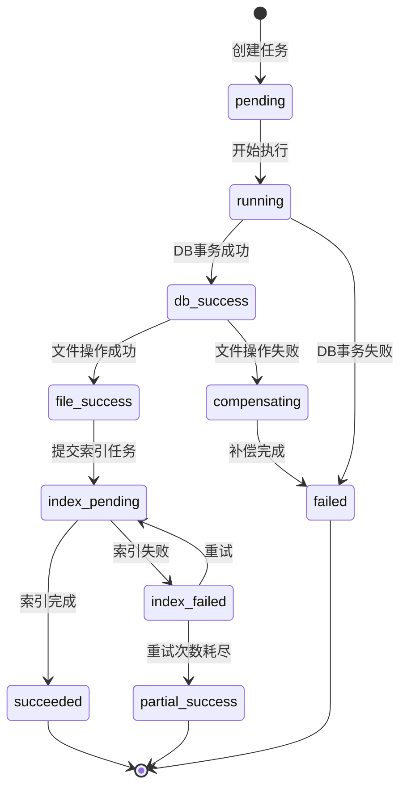

### 16.3 异步任务状态机

#### 16.3.1 任务状态定义

| 状态 | 说明 | 可转换状态 |
| --- | --- | --- |
| `pending` | 待执行 | running |
| `running` | 执行中 | succeeded, failed, compensating |
| `succeeded` | 执行成功 | - |
| `failed` | 执行失败 | pending（重试） |
| `compensating` | 补偿中 | failed |
| `partial_success` | 部分成功 | pending（重试） |

#### 16.3.2 任务表设计

**`index_jobs` 表（索引任务）：**

| 字段 | 类型 | 说明 |
| --- | --- | --- |
| id | BIGINT | 主键 |
| job_type | VARCHAR | 任务类型：create/update/delete |
| skill_uid | VARCHAR | Skill 唯一标识 |
| revision | VARCHAR | 版本号 |
| status | VARCHAR | 任务状态 |
| retry_count | INT | 重试次数 |
| max_retries | INT | 最大重试次数 |
| error_message | TEXT | 错误信息 |
| started_at | DATETIME | 开始时间 |
| finished_at | DATETIME | 完成时间 |
| created_at | DATETIME | 创建时间 |

**`sync_jobs` 表（同步任务）：**

| 字段 | 类型 | 说明 |
| --- | --- | --- |
| id | BIGINT | 主键 |
| repo_source_id | BIGINT | 仓库源 ID |
| trigger_type | VARCHAR | 触发类型：manual/scheduled |
| status | VARCHAR | 任务状态 |
| revision_before | VARCHAR | 同步前版本 |
| revision_after | VARCHAR | 同步后版本 |
| skills_changed_count | INT | 变更 Skill 数量 |
| retry_count | INT | 重试次数 |
| error_message | TEXT | 错误信息 |
| started_at | DATETIME | 开始时间 |
| finished_at | DATETIME | 完成时间 |
| created_at | DATETIME | 创建时间 |

### 16.4 一致性保证机制

#### 16.4.1 写流程设计

**私有 Skill 创建流程：**

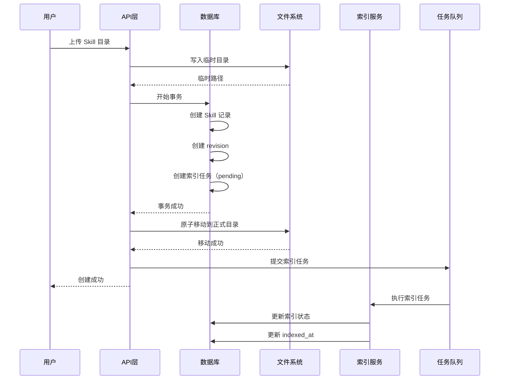

**失败处理：**

1. **临时文件写入失败**：直接返回错误，无需清理
2. **数据库事务失败**：清理临时文件，返回错误
3. **文件移动失败**：回滚数据库事务，清理临时文件
4. **索引任务失败**：任务保持 pending 状态，等待重试

#### 16.4.2 补偿机制

**文件操作补偿：**

```python
async def compensate_file_operation(skill_uid: str, temp_dir: str):
    """补偿文件操作"""
    try:
        # 1. 删除正式目录（如果已移动）
        formal_dir = get_skill_dir(skill_uid)
        if os.path.exists(formal_dir):
            shutil.rmtree(formal_dir)
        
        # 2. 删除临时目录
        if os.path.exists(temp_dir):
            shutil.rmtree(temp_dir)
        
        logger.info(f"Compensation completed for skill {skill_uid}")
    except Exception as e:
        logger.error(f"Compensation failed for skill {skill_uid}: {e}")
        # 记录补偿失败，需要人工介入
        await alert_admin(f"Compensation failed: {skill_uid}")
```

**索引任务重试：**

```python
async def retry_index_job(job_id: int):
    """重试索引任务"""
    job = await index_job_repository.get_by_id(job_id)
    
    if job.retry_count >= job.max_retries:
        job.status = 'failed'
        await index_job_repository.update(job)
        await alert_admin(f"Index job failed after {job.max_retries} retries: {job_id}")
        return
    
    try:
        job.status = 'running'
        job.retry_count += 1
        await index_job_repository.update(job)
        
        # 执行索引
        await index_service.build_index(job.skill_uid, job.revision)
        
        job.status = 'succeeded'
        job.finished_at = datetime.now()
        await index_job_repository.update(job)
        
    except Exception as e:
        job.status = 'pending'
        job.error_message = str(e)
        await index_job_repository.update(job)
        
        # 延迟重试
        await schedule_retry(job_id, delay=60 * job.retry_count)
```

### 16.5 状态字段设计

所有状态字段已整合到第18章的表结构定义中，包括：
+ `skills` 表：`sync_status`、`index_status`、`last_sync_at`、`last_index_at`
+ `repo_sources` 表：`sync_status`、`last_sync_job_id`

**状态枚举说明：**

`sync_status`：
- `synced`：已同步
- `syncing`：同步中
- `sync_failed`：同步失败

`index_status`：
- `indexed`：已索引
- `indexing`：索引中
- `index_failed`：索引失败
- `pending`：待索引

`repo_sources.sync_status`：
- `idle`：空闲
- `syncing`：同步中
- `sync_failed`：同步失败
- `deleted`：已删除

### 16.6 管理命令

#### 16.6.1 索引管理命令

```bash
# 重建单个 Skill 索引
python manage.py rebuild-index --skill-uid sk_01JXYZ

# 重建所有索引
python manage.py rebuild-index --all

# 修复失败的索引任务
python manage.py retry-failed-index-jobs

# 检查索引一致性
python manage.py check-index-consistency
```

#### 16.6.2 同步管理命令

```bash
# 手动同步仓库
python manage.py sync-repo --repo-id repo_01JABC

# 重试失败的同步任务
python manage.py retry-failed-sync-jobs

# 检查同步状态
python manage.py check-sync-status
```

#### 16.6.3 一致性检查命令

```bash
# 检查文件系统与数据库一致性
python manage.py check-consistency --fix

# 修复丢失的索引
python manage.py repair-missing-indexes

# 清理孤立文件
python manage.py cleanup-orphan-files
```

### 16.7 监控与告警

#### 16.7.1 监控指标

+ **任务队列长度**：pending 状态任务数量
+ **任务失败率**：failed 状态任务占比
+ **任务执行时长**：任务从创建到完成的时长
+ **索引延迟**：Skill 创建到索引完成的时间差

#### 16.7.2 告警规则

+ pending 任务超过 100 个
+ failed 任务超过 10 个
+ 索引延迟超过 10 分钟
+ 补偿失败

---

## 17. 核心业务流程

### 17.1 私有 Skill 新建总流程

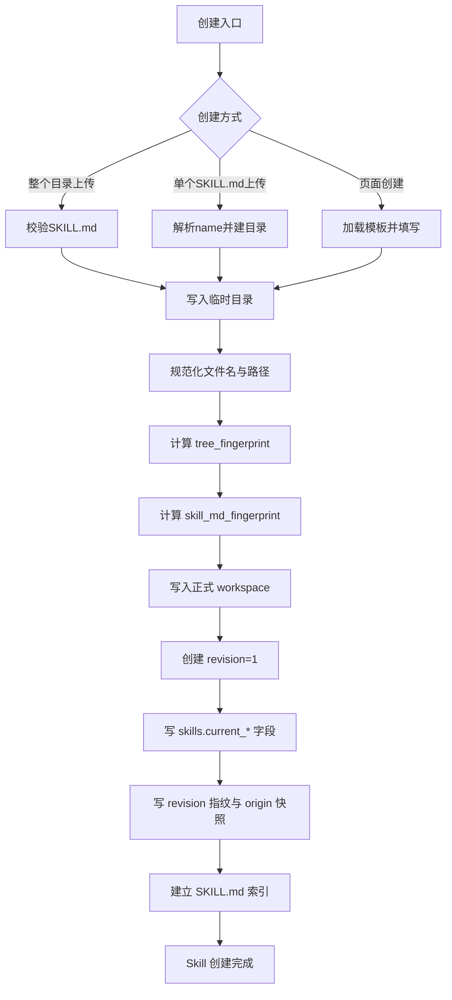

### 15.2 私有 Skill 编辑总流程

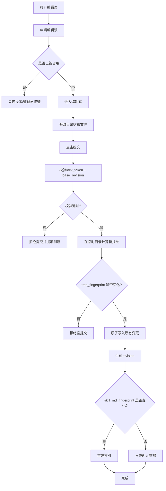

### 15.3 Git 仓库导入总流程

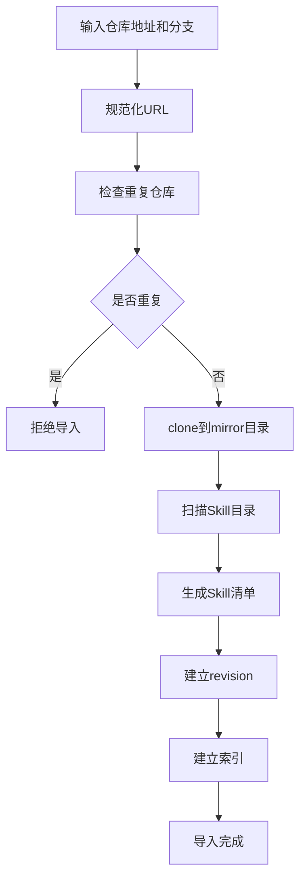

---

## 17. 页面设计

### 17.1 页面列表

#### 1. Skill 列表页

**支持：**
+ 搜索
+ 来源筛选
+ 排序
+ 进入详情页

#### 2. Skill 详情页

**展示：**
+ `SKILL.md` 渲染内容
+ 左侧目录树
+ 下载按钮
+ 时间线入口
+ 删除按钮

#### 3. 私有 Skill 编辑页

**展示：**
+ 左侧目录树
+ 右侧编辑区
+ 锁状态
+ 提交按钮

#### 4. Git 仓库管理页

**展示：**
+ 仓库列表
+ 导入
+ 手动同步
+ 删除来源仓库

#### 5. 时间线页

**展示：**
+ revision 列表
+ 文件级变更详情

---

## 18. 数据库设计

### 18.1 设计原则

+ SQLite 默认，PostgreSQL 可选增强
+ 向量检索与全文检索不依赖数据库插件
+ 仅在 `SKILL.md` 变化时重建搜索索引

### 18.2 核心表

#### `users`

| 字段 | 类型 | 说明 |
| --- | --- | --- |
| id | BIGINT | 主键 |
| username | VARCHAR | 用户名 |
| password_hash | VARCHAR | 密码哈希 |
| role | VARCHAR | admin / member |
| is_active | BOOLEAN | 是否激活 |
| created_at | DATETIME | 创建时间 |
| updated_at | DATETIME | 更新时间 |

#### `repo_sources`

| 字段 | 类型 | 说明 |
| --- | --- | --- |
| id | BIGINT | 主键 |
| name | VARCHAR | 仓库名称 |
| repo_url | VARCHAR | 仓库地址 |
| normalized_repo_url | VARCHAR | 规范化仓库地址 |
| branch | VARCHAR | 分支 |
| default_branch | VARCHAR | 默认分支 |
| auth_type | VARCHAR | 认证类型 |
| auth_secret_ref | VARCHAR | 认证凭据引用 |
| sync_enabled | BOOLEAN | 是否启用同步 |
| sync_cron | VARCHAR | 同步 cron 表达式 |
| sync_status | VARCHAR | 同步状态：idle / syncing / sync_failed / deleted |
| last_synced_at | DATETIME | 最后同步时间 |
| last_synced_commit | VARCHAR | 最后同步 commit |
| last_scanned_tree_fingerprint | VARCHAR | 最后扫描目录指纹 |
| last_revision | VARCHAR | 最后同步 revision |
| last_sync_job_id | BIGINT | 最后同步任务 ID |
| status | VARCHAR | 状态：active / deleted |
| created_by | VARCHAR | 创建人 |
| created_at | DATETIME | 创建时间 |
| updated_at | DATETIME | 更新时间 |

**唯一约束：**
+ `(normalized_repo_url, branch)` UNIQUE

**索引：**
+ `idx_repo_sources_status` ON (status)
+ `idx_repo_sources_sync_enabled` ON (sync_enabled)
+ `idx_repo_sources_sync_status` ON (sync_status)
+ `idx_repo_sources_last_synced_at` ON (last_synced_at)

#### `skills`

| 字段 | 类型 | 说明 |
| --- | --- | --- |
| id | BIGINT | 主键 |
| skill_uid | VARCHAR | Skill 唯一标识 |
| slug | VARCHAR | Skill URL 友好名称 |
| source_type | VARCHAR | private / git |
| repo_source_id | BIGINT | Git 源 ID（外键） |
| relative_dir | VARCHAR | 相对目录 |
| entry_file | VARCHAR | 入口文件 |
| current_revision | VARCHAR | 当前版本 |
| origin_type | VARCHAR | 来源类型：private / git |
| origin_locator | VARCHAR | 统一来源定位串 |
| origin_mode | VARCHAR | 来源模式：upload_folder / upload_skill_md / web_create / git_import |
| current_tree_fingerprint | VARCHAR | 当前目录指纹 |
| current_skill_md_fingerprint | VARCHAR | 当前 SKILL.md 指纹 |
| current_manifest_version | INTEGER | 当前 manifest 版本 |
| sync_status | VARCHAR | 同步状态：synced / syncing / sync_failed |
| index_status | VARCHAR | 索引状态：indexed / indexing / index_failed / pending |
| updated_at | DATETIME | 目录更新时间 |
| search_updated_at | DATETIME | 检索更新时间 |
| indexed_at | DATETIME | 索引时间 |
| last_sync_at | DATETIME | 最后同步时间 |
| last_index_at | DATETIME | 最后索引时间 |
| favorite_count | INT | 收藏数 |
| download_count | INT | 下载数 |
| status | VARCHAR | 状态：active / deleted / archived |
| created_by | VARCHAR | 创建人 |
| updated_by | VARCHAR | 更新人 |
| created_at | DATETIME | 创建时间 |
| deleted_at | DATETIME | 删除时间（软删除） |

**唯一约束：**
+ `skill_uid` UNIQUE
+ `(repo_source_id, relative_dir)` UNIQUE（Git Skill）

**索引：**
+ `idx_skills_slug` ON (slug)
+ `idx_skills_source_type` ON (source_type)
+ `idx_skills_repo_source_id` ON (repo_source_id)
+ `idx_skills_status` ON (status)
+ `idx_skills_updated_at` ON (updated_at)
+ `idx_skills_search_updated_at` ON (search_updated_at)
+ `idx_skills_sync_status` ON (sync_status)
+ `idx_skills_index_status` ON (index_status)
+ `idx_skills_deleted_at` ON (deleted_at)

#### `skill_current_docs`

当前检索文档快照。

| 字段 | 类型 | 说明 |
| --- | --- | --- |
| id | BIGINT | 主键 |
| skill_uid | VARCHAR | Skill 唯一标识 |
| title | VARCHAR | 标题 |
| summary | TEXT | 摘要 |
| tags_json | TEXT | 标签 JSON |
| body_markdown | TEXT | Markdown 正文 |
| body_plaintext | TEXT | 纯文本正文 |
| content_hash | VARCHAR | 内容哈希 |
| revision | VARCHAR | 版本号 |
| updated_at | DATETIME | 更新时间 |

**唯一约束：**
+ `skill_uid` UNIQUE

**索引：**
+ `idx_skill_current_docs_revision` ON (revision)
+ `idx_skill_current_docs_content_hash` ON (content_hash)
+ `idx_skill_current_docs_updated_at` ON (updated_at)

#### `skill_revisions`

| 字段 | 类型 | 说明 |
| --- | --- | --- |
| id | BIGINT | 主键 |
| skill_uid | VARCHAR | Skill 唯一标识 |
| revision | VARCHAR | 版本号 |
| parent_revision | VARCHAR | 父版本号 |
| source_type | VARCHAR | private / git |
| committed_by | VARCHAR | 提交人 |
| committed_at | DATETIME | 提交时间 |
| has_skill_md_change | BOOLEAN | 是否包含 SKILL.md 变更 |
| has_other_files_change | BOOLEAN | 是否包含其他文件变更 |
| change_scope | VARCHAR | non_index_files_only / skill_md_only / mixed |
| changed_files_count | INT | 变更文件数 |
| added_files_count | INT | 新增文件数 |
| modified_files_count | INT | 修改文件数 |
| deleted_files_count | INT | 删除文件数 |
| affects_search | BOOLEAN | 是否影响搜索 |
| summary | TEXT | 变更摘要 |
| tree_fingerprint | VARCHAR | 目录树指纹 |
| skill_md_fingerprint | VARCHAR | SKILL.md 文件指纹 |
| origin_snapshot_json | TEXT | 来源快照 JSON |
| manifest_json | TEXT | 目录清单 JSON |
| change_summary_json | TEXT | 变更摘要 JSON |

**唯一约束：**
+ `(skill_uid, revision)` UNIQUE

**索引：**
+ `idx_skill_revisions_skill_uid` ON (skill_uid)
+ `idx_skill_revisions_committed_at` ON (committed_at)
+ `idx_skill_revisions_parent_revision` ON (parent_revision)
+ `idx_skill_revisions_affects_search` ON (affects_search)

#### `skill_revision_files`

| 字段 | 类型 | 说明 |
| --- | --- | --- |
| id | BIGINT | 主键 |
| skill_uid | VARCHAR | Skill 唯一标识 |
| revision | VARCHAR | 版本号 |
| relative_path | VARCHAR | 相对路径 |
| change_type | VARCHAR | add / modify / delete / rename |
| is_skill_md | BOOLEAN | 是否为 SKILL.md |
| file_ext | VARCHAR | 文件扩展名 |
| size_before | BIGINT | 变更前大小 |
| size_after | BIGINT | 变更后大小 |
| old_file_sha256 | VARCHAR | 变更前文件 SHA256 |
| new_file_sha256 | VARCHAR | 变更后文件 SHA256 |
| file_size | BIGINT | 文件大小 |
| hash_before | VARCHAR | 变更前哈希 |
| hash_after | VARCHAR | 变更后哈希 |
| preview_mode | VARCHAR | 预览模式 |

**索引：**
+ `idx_skill_revision_files_skill_uid` ON (skill_uid)
+ `idx_skill_revision_files_revision` ON (revision)
+ `idx_skill_revision_files_is_skill_md` ON (is_skill_md)
+ `idx_skill_revision_files_change_type` ON (change_type)
+ UNIQUE `(skill_uid, revision, relative_path)`

#### `skill_files_current`

当前目录树快照。

| 字段 | 类型 | 说明 |
| --- | --- | --- |
| id | BIGINT | 主键 |
| skill_uid | VARCHAR | Skill 唯一标识 |
| revision | VARCHAR | 版本号 |
| relative_path | VARCHAR | 相对路径 |
| file_name | VARCHAR | 文件名 |
| is_dir | BOOLEAN | 是否目录 |
| file_ext | VARCHAR | 文件扩展名 |
| size_bytes | BIGINT | 文件大小 |
| mime_type | VARCHAR | MIME 类型 |
| preview_mode | VARCHAR | 预览模式 |
| sort_order | INT | 排序 |

**唯一约束：**
+ `(skill_uid, relative_path)` UNIQUE

**索引：**
+ `idx_skill_files_current_skill_uid` ON (skill_uid)
+ `idx_skill_files_current_revision` ON (revision)
+ `idx_skill_files_current_is_dir` ON (is_dir)
+ `idx_skill_files_current_file_ext` ON (file_ext)

#### `skill_favorites`

| 字段 | 类型 | 说明 |
| --- | --- | --- |
| id | BIGINT | 主键 |
| user_id | BIGINT | 用户 ID（外键） |
| skill_uid | VARCHAR | Skill 唯一标识 |
| created_at | DATETIME | 创建时间 |

**唯一约束：**
+ `(user_id, skill_uid)` UNIQUE

**索引：**
+ `idx_skill_favorites_user_id` ON (user_id)
+ `idx_skill_favorites_skill_uid` ON (skill_uid)
+ `idx_skill_favorites_created_at` ON (created_at)

#### `notifications`

| 字段 | 类型 | 说明 |
| --- | --- | --- |
| id | BIGINT | 主键 |
| user_id | BIGINT | 用户 ID（外键） |
| type | VARCHAR | 通知类型 |
| skill_uid | VARCHAR | Skill 唯一标识 |
| revision | VARCHAR | 版本号 |
| title | VARCHAR | 标题 |
| content | TEXT | 内容 |
| is_read | BOOLEAN | 是否已读 |
| created_at | DATETIME | 创建时间 |

**索引：**
+ `idx_notifications_user_id` ON (user_id)
+ `idx_notifications_is_read` ON (is_read)
+ `idx_notifications_created_at` ON (created_at)
+ `idx_notifications_type` ON (type)
+ `idx_notifications_skill_uid` ON (skill_uid)

#### `skill_downloads`

| 字段 | 类型 | 说明 |
| --- | --- | --- |
| id | BIGINT | 主键 |
| user_id | BIGINT | 用户 ID（外键） |
| actor_name | VARCHAR | 操作人名称 |
| skill_uid | VARCHAR | Skill 唯一标识 |
| revision | VARCHAR | 版本号 |
| package_name | VARCHAR | 包名 |
| source_type | VARCHAR | 来源类型 |
| created_at | DATETIME | 创建时间 |

**索引：**
+ `idx_skill_downloads_user_id` ON (user_id)
+ `idx_skill_downloads_skill_uid` ON (skill_uid)
+ `idx_skill_downloads_created_at` ON (created_at)
+ `idx_skill_downloads_source_type` ON (source_type)

#### `sync_jobs`

| 字段 | 类型 | 说明 |
| --- | --- | --- |
| id | BIGINT | 主键 |
| repo_source_id | BIGINT | 仓库源 ID（外键） |
| trigger_type | VARCHAR | 触发类型：manual / scheduled |
| status | VARCHAR | 状态：pending / running / succeeded / failed |
| revision_before | VARCHAR | 同步前版本 |
| revision_after | VARCHAR | 同步后版本 |
| skills_changed_count | INT | 变更 Skill 数量 |
| retry_count | INT | 重试次数 |
| error_message | TEXT | 错误信息 |
| started_at | DATETIME | 开始时间 |
| finished_at | DATETIME | 结束时间 |
| created_at | DATETIME | 创建时间 |

**索引：**
+ `idx_sync_jobs_repo_source_id` ON (repo_source_id)
+ `idx_sync_jobs_status` ON (status)
+ `idx_sync_jobs_created_at` ON (created_at)
+ `idx_sync_jobs_started_at` ON (started_at)
+ `idx_sync_jobs_trigger_type` ON (trigger_type)

#### `index_jobs`

| 字段 | 类型 | 说明 |
| --- | --- | --- |
| id | BIGINT | 主键 |
| job_type | VARCHAR | 任务类型：create / update / delete |
| skill_uid | VARCHAR | Skill 唯一标识 |
| revision | VARCHAR | 版本号 |
| status | VARCHAR | 状态：pending / running / succeeded / failed |
| retry_count | INT | 重试次数 |
| max_retries | INT | 最大重试次数 |
| error_message | TEXT | 错误信息 |
| started_at | DATETIME | 开始时间 |
| finished_at | DATETIME | 完成时间 |
| created_at | DATETIME | 创建时间 |

**索引：**
+ `idx_index_jobs_skill_uid` ON (skill_uid)
+ `idx_index_jobs_status` ON (status)
+ `idx_index_jobs_created_at` ON (created_at)
+ `idx_index_jobs_job_type` ON (job_type)

#### `audit_logs`

| 字段 | 类型 | 说明 |
| --- | --- | --- |
| id | BIGINT | 主键 |
| trace_id | VARCHAR | 链路追踪 ID |
| timestamp | DATETIME | 操作时间 |
| actor_id | BIGINT | 操作人 ID |
| actor_name | VARCHAR | 操作人名称 |
| actor_ip | VARCHAR | 操作人 IP |
| action | VARCHAR | 操作类型 |
| action_type | VARCHAR | 操作分类：read / write / delete / admin |
| target_type | VARCHAR | 目标类型：skill / repo / user / system |
| target_id | VARCHAR | 目标 ID |
| target_name | VARCHAR | 目标名称 |
| detail_json | TEXT | 操作详情 JSON |
| result | VARCHAR | 操作结果：success / failure |
| error_message | TEXT | 错误信息 |
| duration_ms | INT | 操作耗时（毫秒） |
| created_at | DATETIME | 创建时间 |

**索引：**
+ `idx_audit_logs_timestamp` ON (timestamp)
+ `idx_audit_logs_actor_id` ON (actor_id)
+ `idx_audit_logs_action` ON (action)
+ `idx_audit_logs_target` ON (target_type, target_id)
+ `idx_audit_logs_trace_id` ON (trace_id)
+ `idx_audit_logs_action_type` ON (action_type)

#### `edit_sessions`

记录私有 Skill 编辑锁。

| 字段 | 类型 | 说明 |
| --- | --- | --- |
| id | BIGINT | 主键 |
| skill_uid | VARCHAR | Skill 唯一标识 |
| lock_token | VARCHAR | 锁令牌 |
| locked_by | VARCHAR | 锁持有者 |
| locked_by_user_id | BIGINT | 锁持有者用户 ID |
| base_revision | VARCHAR | 基线版本号 |
| base_tree_fingerprint | VARCHAR | 基线目录指纹 |
| expire_at | DATETIME | 过期时间 |
| heartbeat_at | DATETIME | 最后心跳时间 |
| status | VARCHAR | 状态：active / released / expired / taken_over |
| takeover_by | VARCHAR | 接管人 |
| takeover_at | DATETIME | 接管时间 |
| created_at | DATETIME | 创建时间 |

**唯一约束：**
+ `skill_uid` UNIQUE（同一 skill 只能有一个 active lock）

**索引：**
+ `idx_edit_sessions_lock_token` ON (lock_token)
+ `idx_edit_sessions_locked_by` ON (locked_by)
+ `idx_edit_sessions_expire_at` ON (expire_at)
+ `idx_edit_sessions_status` ON (status)

#### `resource_roles`

资源角色分配表。

| 字段 | 类型 | 说明 |
| --- | --- | --- |
| id | BIGINT | 主键 |
| user_id | BIGINT | 用户 ID（外键） |
| resource_type | VARCHAR | 资源类型：skill / repo |
| resource_id | VARCHAR | 资源 ID |
| role | VARCHAR | 角色：owner / maintainer / editor / viewer |
| assigned_by | VARCHAR | 分配人 |
| assigned_at | DATETIME | 分配时间 |
| created_at | DATETIME | 创建时间 |

**唯一约束：**
+ `(user_id, resource_type, resource_id)` UNIQUE

**索引：**
+ `idx_resource_roles_user_id` ON (user_id)
+ `idx_resource_roles_resource` ON (resource_type, resource_id)
+ `idx_resource_roles_role` ON (role)

#### `users`

| 字段 | 类型 | 说明 |
| --- | --- | --- |
| id | BIGINT | 主键 |
| username | VARCHAR | 用户名 |
| email | VARCHAR | 邮箱 |
| password_hash | VARCHAR | 密码哈希 |
| role | VARCHAR | 系统角色：admin / member |
| is_active | BOOLEAN | 是否激活 |
| last_login_at | DATETIME | 最后登录时间 |
| created_at | DATETIME | 创建时间 |
| updated_at | DATETIME | 更新时间 |

**唯一约束：**
+ `username` UNIQUE
+ `email` UNIQUE

**索引：**
+ `idx_users_role` ON (role)
+ `idx_users_is_active` ON (is_active)

---

## 19. API 设计

### 19.1 私有 Skill 管理

+ `POST /skills/private/upload-folder`
+ `POST /skills/private/upload-skill-md`
+ `POST /skills/private/create`
+ `PUT /skills/private/{skill_uid}`
+ `DELETE /skills/private/{skill_uid}`

### 19.2 编辑锁

+ `POST /skills/private/{skill_uid}/edit-session`
+ `POST /skills/private/{skill_uid}/edit-session/heartbeat`
+ `DELETE /skills/private/{skill_uid}/edit-session`

### 19.3 Git 仓库管理

+ `POST /repos/import`
+ `POST /repos/{repo_id}/sync`
+ `DELETE /repos/{repo_id}`

### 19.4 通用

+ `GET /skills`
+ `GET /skills/{skill_uid}`
+ `GET /skills/{skill_uid}/tree`
+ `GET /skills/{skill_uid}/timeline`
+ `GET /skills/{skill_uid}/timeline/{revision}`
+ `GET /skills/{skill_uid}/download`

---

## 20. 配置设计

### `app.yml`

```yaml
app:
  mode: single
  serve_frontend: true
```

### `auth.yml`

```yaml
auth:
  enabled: false
  anonymous_actor_name: anonymous
```

### `workspace.yml`

```yaml
workspace:
  private_dir: /app/workspace/private-skills
  mirror_dir: /app/workspace/mirrors
```

### `scheduler.yml`

```yaml
scheduler:
  nightly_purge_cron: "0 0 * * *"
  git_sync_enabled: true
```

---

## 21. 部署方案

### 默认推荐

+ 单体 FastAPI
+ SQLite
+ Docker Compose
+ 挂载 `config/`、`workspace/`、`data/`

### 适用场景

+ 私有化部署
+ 中小团队
+ 快速初始化
+ 快速试用
+ 后续再升级 PostgreSQL

---

## 22. 实施阶段建议

### Phase 1：核心功能（MVP）

**目标：** 建立基础平台能力

**必须实现：**
+ 私有 Skill 上传（目录上传、单文件上传）
+ 页面创建
+ 页面编辑（含编辑锁）
+ 时间线展示
+ 基础搜索（全文检索）
+ 下载功能
+ **origin 追踪**：记录 Skill 来源信息
+ **fingerprint 机制**：双层指纹（tree_fingerprint + skill_md_fingerprint）
+ **标签体系**：多维度标签系统

**关键验收点：**
+ 能准确判断 Skill 内容是否真正变化
+ 能追溯每个 Skill 的来源
+ 能区分"空提交"和"真实变更"

### Phase 2：Git 集成

**目标：** 支持外部 Git 仓库

**必须实现：**
+ Git 仓库导入
+ 重复仓库检查（基于 normalized_repo_url）
+ 手动同步 / 定时同步
+ 仓库级删除
+ 搜索增强（召回层、精排层、业务加权）
+ **同步优化**：基于 fingerprint 判断是否需要更新

**关键验收点：**
+ 能准确识别 Git 仓库中的 Skill 目录
+ 能基于 fingerprint 判断是否需要生成新 revision
+ 能正确处理 Git 仓库更新时的冲突

### Phase 3：企业功能

**目标：** 企业级能力

**必须实现：**
+ 登录模式（JWT/OIDC）
+ 收藏功能
+ 消息通知
+ 更细粒度审计与管理能力
+ PostgreSQL 支持
+ FAISS / rerank 搜索优化
+ **CLI/IDE 集成**：支持 skills.lock.json 导出

**关键验收点：**
+ 支持企业级认证和权限管理
+ 支持项目级依赖锁定
+ 支持高性能搜索

---

## 23. 最终定稿结论

本版最终收敛为一句话：

> **整个 Skill 目录负责管理、版本、时间线、下载与删除；`SKILL.md` 只负责搜索。**

并且进一步明确了 6 个关键落地点：

1. 私有 Skill 支持 **目录上传 / 单个 `SKILL.md` 上传 / 页面模板创建**
2. 只有私有 Skill 支持页面编辑，且编辑是 **整包一次性提交**
3. 多人编辑采用 **软锁 + 基线 revision 校验**
4. Git Skill 不支持页面编辑，只支持仓库级导入、同步、删除
5. 删除全部要求 **二次确认**
6. 私有 Skill 删除采用 **立即隐藏 + 凌晨物理清理** 的两阶段模式

---

## 24. 一句话总结

**这是一个以 Skill 包为管理单位、以 `SKILL.md` 为搜索入口、以单体架构为落地方式的轻量 Skills Hub 平台方案。**
